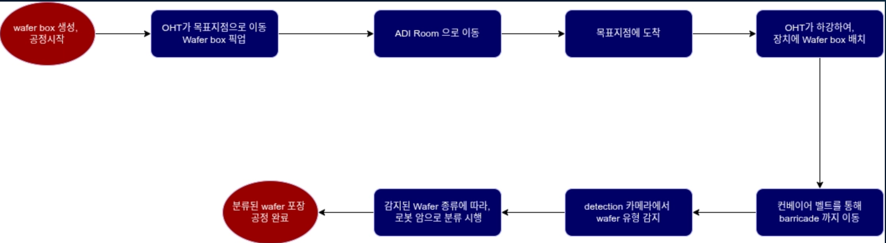
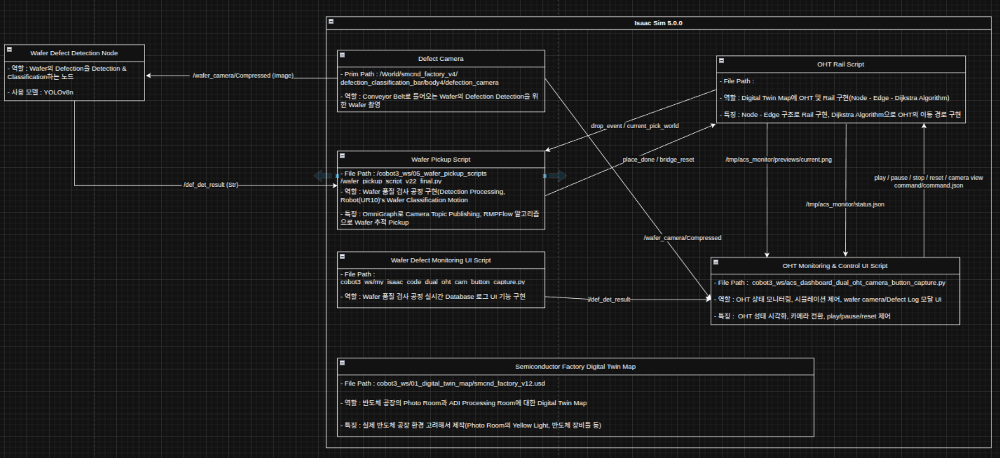

# 🏭 Semiconductor Digital Twin — Wafer Defect Detection & Cobot Automation

**YOLOv8 기반 웨이퍼 불량 탐지**와 **UR10 협동 로봇 픽업 자동화**, **Digital Twin 시뮬레이션**, **OHT 레일 제어**를 통합한 반도체 공정 자동화 시스템입니다.

---

## 🛠️ Tech Stack

* **Robot Control**: Python, ROS 2 Humble, UR10 ROS 2 Driver
* **AI & Vision**: **YOLOv8** (웨이퍼 불량 탐지), OpenCV
* **Digital Twin**: ROS 2 기반 시뮬레이션 환경
* **UI Integration**: 실시간 모니터링 대시보드
* **Hardware**: UR10 Collaborative Robot, OHT Rail System

---

## 📂 Project Structure

```text
cobot3_ws/
├── 01_digital_twin_map/          # Digital Twin 맵 구성 리소스
├── 02_lecture_files/             # 강의 및 참고 자료
├── 03_cobot_motions/             # UR10 코봇 모션 스크립트
├── 04_wafer_deflection_det/      # 웨이퍼 불량 탐지 (YOLO 학습 포함)
│   ├── simulation_set/           # 시뮬레이션용 설정 파일
│   ├── wafer_dataset/            # 학습/검증/테스트 데이터셋
│   │   ├── train/
│   │   ├── val/
│   │   └── test/
│   └── yolo_wafer/               # YOLO 학습 결과 및 모델 weights
│       └── (train_YYYYMMDD_HHMMSS/weights)
├── 05_wafer_pickup_scripts/      # 웨이퍼 픽업 자동화 스크립트
├── 06_defection_detection_node/  # ROS 2 불량 탐지 노드
├── 07_ui_integration/            # 모니터링 UI 통합
├── 08_cobot3_videos/             # 시연 영상 모음
└── 09_oht_rail/                  # OHT 레일 제어 모듈
```

---

## 🌟 Key Features

### 1. Wafer Defect Detection (웨이퍼 불량 탐지)

* **YOLOv8** 모델을 커스텀 웨이퍼 데이터셋으로 파인튜닝하여 불량 웨이퍼를 실시간 탐지합니다.
* `train / val / test` 분리 구조로 체계적인 모델 학습 및 평가를 수행합니다.
* 복수의 학습 실험(train_20260310, train_20260313 등)을 통해 최적 모델 weights를 선정합니다.

### 2. Cobot Pickup Automation (협동 로봇 자동화)

* **UR10** 협동 로봇이 탐지된 불량 웨이퍼의 좌표를 수신하여 자동 픽업 동작을 수행합니다.
* ROS 2 기반 모션 노드(`03_cobot_motions`, `05_wafer_pickup_scripts`)로 작업별 최적화된 궤적을 생성합니다.

### 3. Digital Twin Simulation (디지털 트윈)

* 실제 공정 환경을 가상으로 재현한 Digital Twin 맵(`01_digital_twin_map`)을 구성합니다.
* 물리 로봇 동작 전 시뮬레이션으로 안전성과 경로를 사전 검증합니다.

### 4. OHT Rail Control (OHT 레일 제어)

* 반도체 팹 내 웨이퍼 이송 장비인 **OHT(Overhead Hoist Transport)** 레일 제어 모듈을 포함합니다.
* 탐지 결과 및 로봇 상태와 연동하여 이송 흐름을 자동화합니다.

### 5. Real-time Monitoring UI

* `07_ui_integration` 모듈에서 탐지 결과, 로봇 상태, 공정 흐름을 통합 대시보드로 시각화합니다.

---


## 🏗️ Flow Chart

---


## ⚙️ System Architecture


---

## 🚀 Installation & Running

### 1. Requirements

* **OS**: Ubuntu 22.04 LTS
* **ROS**: ROS 2 Humble
* **Robot Driver**: UR10 ROS 2 Driver (`ur_robot_driver`)
* **Python Libraries**:
  ```bash
  pip install ultralytics opencv-python numpy
  ```
* **Devices**: NVIDIA GeForce RTX 5080 Laptop GPU
* **Simulations**: Isaac Sim 5.0.0

### 2. Dataset Structure

```text
wafer_dataset/
├── train/
│   ├── images/
│   └── labels/
├── val/
│   ├── images/
│   └── labels/
└── test/
    ├── images/
    └── labels/
```

### 3. YOLO 모델 학습

```bash
cd 04_wafer_deflection_det
yolo train data=wafer_dataset/data.yaml model=yolov8n.pt epochs=100 imgsz=640
```

### 4. ROS 2 노드 실행

```bash
# 웨이퍼 불량 탐지 노드
python3 /cobot3_ws/06_defection_detection_node/def_det_v3.py

# UR10 픽업 모션 노드
python3 /cobot3_ws/05_wafer_pickup_scripts/wafer_pickup_script_v22_final.py

# OHT 레일 제어 노드
python3 /cobot3_ws/09_oht_rail/oht_rail_final.py

# UI 모니터링
python3 /cobot3_ws/07_ui_integration/v2.py
```

---

## 📁 Key Directories

| 폴더 | 설명 |
|------|------|
| `04_wafer_deflection_det` | YOLO 학습 데이터셋 및 학습 결과 weights |
| `05_wafer_pickup_scripts` | UR10 웨이퍼 픽업 자동화 스크립트 |
| `06_defection_detection_node` | ROS 2 실시간 탐지 노드 |
| `07_ui_integration` | 통합 모니터링 UI |
| `09_oht_rail` | OHT 이송 레일 제어 모듈 |

--- 
## 🐈 GitHub Address
https://github.com/songsy0203ai-alt/ROKEY-COBOT3
